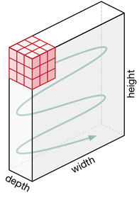
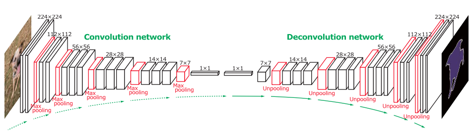
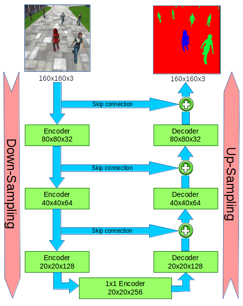
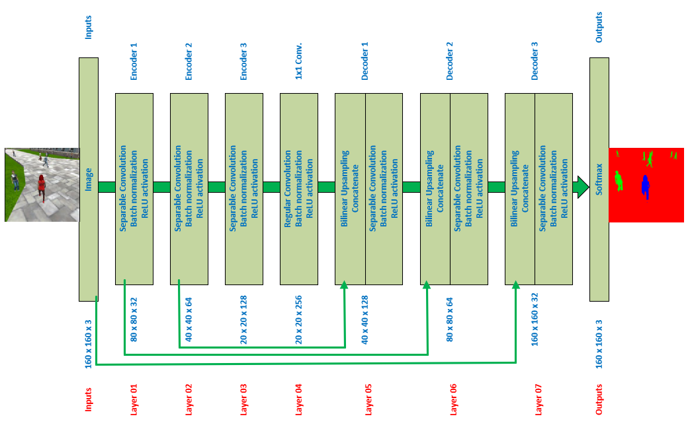
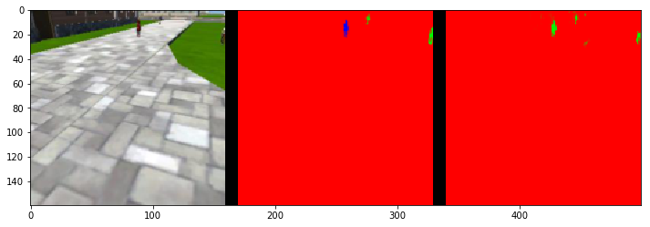
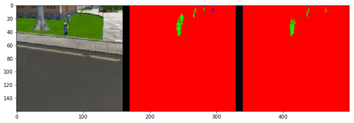
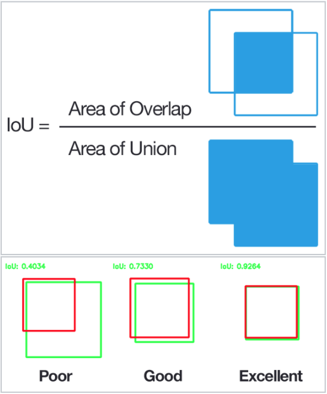

[](https://www.udacity.com/robotics)

# Project : Deep Learning Follow Me

## Writeup by Muthanna A. Attyah
## Mar 2018
## [Rubric](https://review.udacity.com/#!/rubrics/1155/view) Points

In this project we will train a fully convolutional (FCN) deep neural network to identify and track a target in simulation. So-called “follow me” applications like this are key to many fields of robotics and the very same techniques you apply here could be extended to scenarios like advanced cruise control in autonomous vehicles or human-robot collaboration in industry.

<p align="center">  </p>

# What is Fully Convolutional Network (FCN) ?

Before we explain what is **FCN**, first we explain a **CNN**, A normal convolutional neural network layer (**CNN layer**) with a **2D** Kernal size (5x5) looks like following:

<p align="center">  </p>

While **CNN layer** with a **3D** Kernal size (3x3x3) will look like this:

<p align="center">  </p>

In each layer (2D or 3D), the kernal will be moving accross inputs in a predefined stride and record a context (as output) in each move:

<p align="center">  </p>

A CNN might have several layers, each layer might capture a different level in the hierarchy of objects. The first layer is the lowest level in the hierarchy, where the CNN generally classifies small parts of the image into simple shapes like horizontal and vertical lines and simple blobs of colors. The subsequent layers tend to be higher levels in the hierarchy and generally classify more complex ideas like shapes (combinations of lines), and eventually full objects like cars.

a CNN with multiple CNN layers will look as following:

<p align="center">  </p>

CNNs are usually used to classify objects inside an image as shown above, the output is a class of car, truck, van, etc.

A **Fully Convolutional neural network (FCN)** is a normal CNN, where the last fully connected layer (classification layer) is substituted by another 1x1 convolution layer with a large "receptive field". The idea here is to capture the global context of the scene and enable us to tell what are the objects **and their approximate locations** in the scene. The output will be scene segmentation not only object classfication as it is the case in CNN.

The structure of FCN is divided into two parts (**convolution or encoder**) part which will extract features from the image and (**transposed convolution, deconvolution or decoder**) part which will upscale the output of the encoder (or reverse the convolution) so that it is in the original size of the image.

<p align="center">  </p>

A **1x1 convolution** simply maps an input pixel with all it's channels to an output pixel, not looking at anything around itself. It is often used to reduce the number of depth channels, since it is often very slow to multiply volumes with extremely large depths.

When we convert our last fully connected (FC) layer of the CNN to a **1x1** convolutional layer we choose our new conv layer to be big enough so that it will enable us to have this localization effect scaled up to our original input image size then activate pixels to indicate objects and their approximate locations in the scene as shown in above figure. replacement of fully-connected layers with convolutional layers presents an added advantage that during inference (testing your model), you can feed images of any size into your trained network.

One problem with this approach is that we **lose some information** every time we do convolution (**encoding or down-sampling**); we keep the smaller picture (the local context) and lose the bigger picture (the global context) for example if we are using max-pooling to reduce the size of the input, and allow the neural network to focus on only the most important elements. Max pooling does this by only retaining the maximum value for each filtered area, and removing the remaining values.

<p align="center">  </p>

To solve this problem we also get some activation from previous layers (What we call **skip connections**)and sum/interpolate them together with the **up-sampled** outputs when **decoding** from the previous layer as shown in below diagram.

<p align="center">  </p>

**Bilinear Upsampling** by a factor of 2 is generally used in the **decoder blocks** to recover resolution then add it together with the previous encoders layers outputs to get the required up-size. Different factors of upsampling can be used if required.

**Batch normalization** is also used in each FCN layer and it is based on the idea that, instead of just normalizing the inputs to the network, we normalize the inputs to layers within the network. It's called "batch" normalization because during training, we normalize each layer's inputs by using the mean and variance of the values in the current mini-batch. Batch normalization presents us with few advantages: Networks train faster, higher learning rates,Simplifies the creation of deeper networks, and provides a bit of regularization.

So, in summary FCN is consisting of the following components:

* **Encoder blocks**: that will take inputs from previous layers, compress it down to a context losing in the way some of the resolution (the bigger picture).

* **1x1 Convolution block**: that will reduce depth and capture the global context of the scene.

* **Decoder blocks**: that will take inputs from previous layers, decompress it, by up-sampling and adding inputs from previous encoder blocks through skip connections to recover some of the lost information hence do the precise segmentation.

* **Softmax activation**: normal convolution layer takes outputs from last decoder block and activate output pixels to indicate class and location of objects (semantic segmentation).


# When and why we use FCN ?

traditional convolutional networks (**CNN**) are having fully connected layers at the end (as shown above) hence cannot manage different input sizes, where as fully convolutional networks (**FCN**) can have **only convolutional layers** or layers which can manage different input sizes and are faster at that task. This is possible because output depends only on the local area of input; So input can be of arbitrary size and produce correspondingly-sized output with efficient inference and learning.

For this project we will be using FCN for semantic segmentation, however there are many other uses such us scene understanding in which multiple decoders are used to extract multiple meanings from the same trained model.


# Software & Hardware used for Project training:

In order to get the best learning from the lab I have decided to use both my own GPU enabled laptop hardware and AWS instance to do the learning.

I have used the following **laptop** hardware:

* Lenovo Yoga 520 laptop (i7-8550U CPU @ 1.8GHz 16GB Memory)
* NVIDIA GEFORCE 940MX (2GB Memory 384 CUDA cores)

And the following laptop OS/Drivers:

* Ubuntu 16.04 LTS
* NVIDIA Drivers 390.30
* NVIDIA CUDA 8.0
* NVIDIA cuDNN 5.1

Also to speed-up the training I used the following **AWS** instance:

* p2.xlarge instance
* AMI: Udacity Robotics Deep Learning Laboratory 
* 4 x Intel(R) Xeon(R) CPU E5-2686 v4 @ 2.30GHz
* NVIDIA GPU Tesla K80 (1xGK210GL with 12GB Memory & 2496 CUDA cores)
* 61GB Memory

The following frameworks and packages were installed on both Laptop & AWS instance:

* Python 3.x
* Tensorflow GPU 1.2.1
* NumPy 1.11
* SciPy 0.17.0
* eventlet 
* Flask
* h5py
* PIL
* python-socketio
* scikit-image
* transforms3d
* PyQt4/Pyqt5

For the Laptop installation, It took me very long time to figure out the right version of CUDA/cuDNN that will match the selected version of TensorFlow-GPU then later I found this link which clearly states the required CUDA/cuDNN versions:

https://www.tensorflow.org/install/install_sources


# Data Recording

I did not record any data from simulator, I was able to do all required steps using the provided Training, Validation, and Sample Evaluation Data.

<table><tbody>
    <tr><th align="center" colspan="3"> Data Set 1</td></tr>
    <tr><th align="center">Folder</th><th align="center">Content</th></tr>
    <tr><td align="left">/data/train</td><td align="left">4,131 images + 4,131 masks</td></tr>
    <tr><td align="left">/data/validation</td><td align="left">1,184 images + 1,184 masks</td></tr>    
    <tr><td align="left">/data/sample_evalution_data/following_images</td>
       <td align="left">542 images + 542 masks</td></tr><tr>
    <td align="left">/data/sample_evalution_data/patrol_non_targ</td>
       <td align="left"> 270 images + 270 masks</td></tr><tr>
    <td align="left">/data/sample_evalution_data/patrol_with_targ</td>
       <td align="left"> 322 images + 322 masks</td></tr>
</tbody></table>

## Project Code:

Following sections will list all used layers along with its python code:

#### Separable convolution layer:

Separable convolution layers with same padding will be used in all encoder blocks of the FCN and it includes batch normalization with the ReLU activation function as shown in below code:

```python
def separable_conv2d_batchnorm(input_layer, filters, strides=1):
    output_layer = SeparableConv2DKeras(filters=filters,kernel_size=3, strides=strides,
                             padding='same', activation='relu')(input_layer)
    
    output_layer = layers.BatchNormalization()(output_layer) 
    return output_layer
```

#### Regular Conv layer:

Regular convolution block is used for 1x1 convulation with batch normalization and Relu activation.

```python
def conv2d_batchnorm(input_layer, filters, kernel_size=3, strides=1):
    output_layer = layers.Conv2D(filters=filters, kernel_size=kernel_size, strides=strides, 
                      padding='same', activation='relu')(input_layer)
    
    output_layer = layers.BatchNormalization()(output_layer) 
    return output_layer
```

#### Bilinear Upsampling layer

Used in all decoder blocks; Upsampling by a factor of 2 is generally recommended, but we can try out different factors as well.

```python
def bilinear_upsample(input_layer):
    output_layer = BilinearUpSampling2D((2,2))(input_layer)
    return output_layer
```

#### Encoder Blocks

3 Encoder blocks are used, each encoder block is consisting of one separable convolution layer that is having batch normalization and ReLU activation function.

```python
def encoder_block(input_layer, filters, strides):
    
    # Create a separable convolution layer using the separable_conv2d_batchnorm() function.
    output_layer = separable_conv2d_batchnorm(input_layer, filters, strides)
    
    return output_layer
```

#### Decoder Blocks

3 decoder blocks are used, each decoder block is consisting of Upsampler to collect input from a previous layer with smaller size, a concatenate function to add upsampled layer to the input of decoder then pass the resulting output to two layers of separable conv+batch normalization+ReLU activation function.

```python
def decoder_block(small_ip_layer, large_ip_layer, filters):
    
    # Upsample the small input layer using the bilinear_upsample() function.
    upsampled_small_ip_layer = bilinear_upsample(small_ip_layer)
    
    # Concatenate the upsampled and large input layers using layers.concatenate
    output_layer = layers.concatenate([upsampled_small_ip_layer, large_ip_layer])
    
    # Add some number of separable convolution layers
    output_layer = separable_conv2d_batchnorm( output_layer, filters, strides=1)
    output_layer = separable_conv2d_batchnorm( output_layer, filters, strides=1)
    
    return output_layer
```

#### Softmax activation

Last layer in FCN is regular convolution layer with softmax activation and same padding:

```python
    outputs = layers.Conv2D(num_classes, 1, activation='softmax', padding='same')(layer07)
```
    
#### the FCN model:

Below is the code calling blocks explained above, I have added a print function after each block to help showing the size of each layer in the model.

```python
def fcn_model(inputs, num_classes):
    
    # Add Encoder Blocks. 
    # Remember that with each encoder layer, the depth of your model (the number of filters) increases.
    print("Inputs  shape:",inputs.shape, "  \tImage Size in Pixels")
    
    layer01 = encoder_block(inputs , filters=32 , strides=2)
    print("layer01 shape:",layer01.shape, "  \tEncoder Block 1")
    
    layer02 = encoder_block(layer01, filters=64 , strides=2)
    print("layer02 shape:",layer02.shape, "  \tEncoder Block 2")
    
    layer03 = encoder_block(layer02, filters=128, strides=2)
    print("layer03 shape:",layer03.shape, "\tEncoder Block 3")

    # Add 1x1 Convolution layer using conv2d_batchnorm().
    layer04 = conv2d_batchnorm(layer03, filters=256, kernel_size=1, strides=1)
    print("layer04 shape:",layer04.shape, "\t1x1 Conv Layer")
    
    # Add the same number of Decoder Blocks as the number of Encoder Blocks
    layer05 = decoder_block(layer04, layer02, filters=128 )
    print("layer05 shape:",layer05.shape, "\tDecoder Block 1")
    
    layer06 = decoder_block(layer05, layer01, filters=64  )
    print("layer06 shape:",layer06.shape, "  \tDecoder Block 2")
    
    layer07 = decoder_block(layer06, inputs , filters=32  )
    print("layer07 shape:",layer07.shape, "\tDecoder Block 3")
    
    # The function returns the output layer of your model. 
    # "layer07" is the final layer obtained from the last decoder_block()
    
    outputs = layers.Conv2D(num_classes, 1, activation='softmax', padding='same')(layer07)
    print("Outputs shape:",outputs.shape, "\tOutput Size in Pixel")
    
    return outputs
```

Output of the shape print functions is as following:

```
Inputs  shape: (?, 160, 160, 3)   	Image Size in Pixels
layer01 shape: (?, 80, 80, 32)   	Encoder Block 1
layer02 shape: (?, 40, 40, 64)   	Encoder Block 2
layer03 shape: (?, 20, 20, 128) 	Encoder Block 3
layer04 shape: (?, 20, 20, 256) 	1x1 Conv Layer
layer05 shape: (?, 40, 40, 128) 	Decoder Block 1
layer06 shape: (?, 80, 80, 64)   	Decoder Block 2
layer07 shape: (?, 160, 160, 32) 	Decoder Block 3
Outputs shape: (?, 160, 160, 3) 	Output Size in Pixel
```

And the FCN model diagram is as shown below:

<p align="center">  </p>


# Selection of Hyper Parameters:

In the following sections I will explain how each parameter was selected/adjusted for this project:

## Batch Size:

number of training samples/images that get propagated through the network in a single pass. On my Laptop, when I used batch size of 64, 50, 40 and 32 I was getting "**ResourceExhaustedError : OOM when allocating tensor with shape..**" error. I was able to resolve it after reducing the batch size down to **20**. Below screen shot showing the utilization details of the Laptop GPU using this batch size:
<p align="center">  </p>

On AWS, I was able to use bigger batches (100):

Below screen shot showing the utilization details of the AWS GPU using this batch size:
<p align="center">  </p>

## Workers:

maximum number of processes to spin up. In case of laptop I used **8 workers** to fully utilize the power of my Intel i7 processor cores. Below are the actual utilization graphs when no work is done and when training:

<p align="center">  </p>
<p align="center">  </p>

in case of AWS, I used **4 workers** to utilize the 4 CPUs.

## Steps Per Epoch:

number of batches of training images that go through the network in 1 epoch. One recommended value to try would be based on the total number of images in training dataset divided by the batch_size. 

When Using data set 1 and laptop batch=20: steps_per_epoch=4131/20=206.55 **aprox. 207**

When Using data set 1 and AWS batch=100: steps_per_epoch=4131/100=41.31 **aprox. 41**

## Validation Steps:

number of batches of validation images that go through the network in 1 epoch. This is similar to steps_per_epoch, except validation_steps is for the validation dataset.

When Using data set 1 and laptop batch=20: validation_steps=1184/20=59.2 **aprox. 60**

When Using data set 1 and AWS batch=100: validation_steps=1184/100=11.84 **aprox. 12**

## Learning Rate:

parameter that controls the size of weight and bias changes in learning of the training algorithm. I will try values such as 0.01, 0.001, 0.0001 then using brute force will try to find the best fit.

## Number of Epochs:

number of times the entire training dataset gets propagated through the network. An epoch is a single forward and backward pass of the whole dataset. This is used to increase the accuracy of the model without requiring more data. I will try values ranging from 50 - 300 and based on loss/val_loss decrement rate I will decide which value is fit.

Having my own tensorflow GPU enabled machine helped me alot in doing a good number of training runs to compare results of different parameters. Below are the captures of selected attempts along with the related training curve:

<table><tbody>
    <tr><th align="center" colspan="3">Parameters Set 1</td></tr>
    <tr><th align="center">Parameter</th><th align="center">Value</th><td align="center" rowspan="10">
    </td></tr>
    <tr><td align="left">learning_rate</td>   <td align="center">0.01</td></tr>
    <tr><td align="left">batch_size</td>      <td align="center">20</td></tr>
    <tr><td align="left">num_epochs</td>      <td align="center">100</td></tr>
    <tr><td align="left">steps_per_epoch</td> <td align="center">207</td></tr>
    <tr><td align="left">validation_steps</td><td align="center">60</td></tr>
    <tr><td align="left">workers</td>         <td align="center">8</td></tr>
    <tr><td align="left">train_loss</td>      <td align="center">0.0112</td></tr>
    <tr><td align="left">val_loss</td>        <td align="center">0.0266</td></tr>
    <tr><td align="left">final_score</td>     <td align="center">0.4169500244</td></tr>
    <tr>
    <td align="center" colspan="2"><a href="./data/weights/config_model_weights_01">Model Configuration</a></td>
    <td align="center"><a href="./data/weights/model_weights_01">Model Weights</a></td>
    </tr>
</tbody></table>

<table><tbody>
    <tr><th align="center" colspan="3">Parameters Set 2</td></tr>
    <tr><th align="center">Parameter</th><th align="center">Value</th><td align="center" rowspan="10">
    </td></tr>
    <tr><td align="left">learning_rate</td>   <td align="center">0.001</td></tr>
    <tr><td align="left">batch_size</td>      <td align="center">20</td></tr>
    <tr><td align="left">num_epochs</td>      <td align="center">100</td></tr>
    <tr><td align="left">steps_per_epoch</td> <td align="center">207</td></tr>
    <tr><td align="left">validation_steps</td><td align="center">60</td></tr>
    <tr><td align="left">workers</td>         <td align="center">8</td></tr>
    <tr><td align="left">train_loss</td>      <td align="center">0.0107</td></tr>
    <tr><td align="left">val_loss</td>        <td align="center">0.0276</td></tr>
    <tr><td align="left">final_score</td>     <td align="center">0.41550460314</td></tr>
    <tr>
    <td align="center" colspan="2"><a href="./data/weights/config_model_weights_02">Model Configuration</a></td>
    <td align="center"><a href="./data/weights/model_weights_02">Model Weights</a></td>
    </tr>
</tbody></table>

<table><tbody>
    <tr><th align="center" colspan="3">Parameters Set 3</td></tr>
    <tr><th align="center">Parameter</th><th align="center">Value</th><td align="center" rowspan="10">
    </td></tr>
    <tr><td align="left">learning_rate</td>   <td align="center">0.0001</td></tr>
    <tr><td align="left">batch_size</td>      <td align="center">100</td></tr>
    <tr><td align="left">num_epochs</td>      <td align="center">100</td></tr>
    <tr><td align="left">steps_per_epoch</td> <td align="center">41</td></tr>
    <tr><td align="left">validation_steps</td><td align="center">12</td></tr>
    <tr><td align="left">workers</td>         <td align="center">4</td></tr>
    <tr><td align="left">train_loss</td>      <td align="center">0.0295</td></tr>
    <tr><td align="left">val_loss</td>        <td align="center">0.0392</td></tr>
    <tr><td align="left">final_score</td>     <td align="center">0.321985999002</td></tr>
    <tr>
    <td align="center" colspan="2"><a href="./data/weights/config_model_weights_03">Model Configuration</a></td>
    <td align="center"><a href="./data/weights/model_weights_03">Model Weights</a></td>
    </tr>
</tbody></table>

<table><tbody>
    <tr><th align="center" colspan="3">Parameters Set 4</td></tr>
    <tr><th align="center">Parameter</th><th align="center">Value</th><td align="center" rowspan="10">
    </td></tr>
    <tr><td align="left">learning_rate</td>   <td align="center">0.0001</td></tr>
    <tr><td align="left">batch_size</td>      <td align="center">20</td></tr>
    <tr><td align="left">num_epochs</td>      <td align="center">50</td></tr>
    <tr><td align="left">steps_per_epoch</td> <td align="center">207</td></tr>
    <tr><td align="left">validation_steps</td><td align="center">60</td></tr>
    <tr><td align="left">workers</td>         <td align="center">8</td></tr>
    <tr><td align="left">train_loss</td>      <td align="center">0.0221</td></tr>
    <tr><td align="left">val_loss</td>        <td align="center">0.0327</td></tr>
    <tr><td align="left">final_score</td>     <td align="center">0.333103544024</td></tr>
    <tr>
    <td align="center" colspan="2"><a href="./data/weights/config_model_weights_04">Model Configuration</a></td>
    <td align="center"><a href="./data/weights/model_weights_04">Model Weights</a></td>
    </tr>
</tbody></table>

<table><tbody>
    <tr><th align="center" colspan="3">Parameters Set 5</td></tr>
    <tr><th align="center">Parameter</th><th align="center">Value</th><td align="center" rowspan="10">
    </td></tr>
    <tr><td align="left">learning_rate</td>   <td align="center">0.001</td></tr>
    <tr><td align="left">batch_size</td>      <td align="center">100</td></tr>
    <tr><td align="left">num_epochs</td>      <td align="center">200</td></tr>
    <tr><td align="left">steps_per_epoch</td> <td align="center">41</td></tr>
    <tr><td align="left">validation_steps</td><td align="center">12</td></tr>
    <tr><td align="left">workers</td>         <td align="center">4</td></tr>
    <tr><td align="left">train_loss</td>      <td align="center">0.0091</td></tr>
    <tr><td align="left">val_loss</td>        <td align="center">0.0280</td></tr>
    <tr><td align="left">final_score</td>     <td align="center">0.412441029555</td></tr>
    <tr>
    <td align="center" colspan="2"><a href="./data/weights/config_model_weights_05">Model Configuration</a></td>
    <td align="center"><a href="./data/weights/model_weights_05">Model Weights</a></td>
    </tr>
</tbody></table>

# Prediction

To evaluate how well the FCN model is doing under different conditions. We will be using three different predictions available from the helper code provided and data provided (as mentioned above in data gathering section):

Below is taken from one of the test trainings runs (**Parameters Set 5**).

### following_images:
Test how well the network can identify the target while following them.

Images while following the target:

<p align="center">  </p>
<p align="center">  </p>
<p align="center">  </p>

### Scores for while the quad is following behind the target. 
```
number of validation samples intersection over the union evaulated on 542
average intersection over union for background is 0.9959963386666738
average intersection over union for other people is 0.3660663163859051
average intersection over union for the hero is 0.9185733482600896
number true positives: 539, number false positives: 0, number false negatives: 0
```

### patrol_non_targ:
Test how often the network makes a mistake and identifies the wrong person as the target.

Images while at patrol without target:

<p align="center">  </p>
<p align="center">  </p>
<p align="center">  </p>

### Scores for images while the quad is on patrol and the target is not visible
```
number of validation samples intersection over the union evaulated on 270
average intersection over union for background is 0.9868389698527823
average intersection over union for other people is 0.7295714908650386
average intersection over union for the hero is 0.0
number true positives: 0, number false positives: 55, number false negatives: 0
```

### patrol_with_targ: 
Test how well the network can detect the hero from a distance.

Images while at patrol with target:

<p align="center">  </p>
<p align="center">  </p>
<p align="center">  </p>

### This score measures how well the neural network can detect the target from far away
```
number of validation samples intersection over the union evaulated on 322
average intersection over union for background is 0.9964080370721959
average intersection over union for other people is 0.43491105745183406
average intersection over union for the hero is 0.20501600195251274
number true positives: 121, number false positives: 4, number false negatives: 180
```

# Evaluation

We will be using the IoU to calculate the final score. **IoU** is Intersection over Union, where the Intersection set is an **AND** operation (pixels that are truly part of a class AND are classified as part of the class by the network) and the Union is an **OR** operation (pixels that are truly part of that class + pixels that are classified as part of that class by the network).

<p align="center">  </p>

Sum all the true positives, etc from the three datasets to get a weight for the score: **0.7341490545050056**

The IoU for the dataset that never includes the hero is excluded from grading: **0.561794675106**

The Final Grade Score is the pixel wise:

```
average_IoU*(n_true_positive/(n_true_positive+n_false_positive+n_false_negative))
```

So the score is: **0.412441029555**

# Testing Model in the Simulator

I have selected the best model from the above mentioned and copied it to the code folder, started the simulator, then ran the following command to test the model in simulator:

```bash
$ python3 follower.py --pred_viz model_weights
```
The recording of the test is on the following YouTube link


[](http://www.youtube.com/watch?v=vR2EC16uoZU)


# Can we use the same model to track other objects ?

The answer is yes, all what we need is to change the mask data and train again on the new target then use the same network to track  the new object. Network architecture will not change when there is change in target or size of input data. however we need to change the architecture if we wanted add more meanings such as (object distance from camera) or when we want to improve performance of network (such as adding more layers).

# HTML version of model_training.ipynb notebook

HTML version of the model_training.ipynb notebook is on this [link](./model_training.html)

# issues

* Installation of Tensorflow GPU along with the right version of CUDA/cuDNN drivers was a challenge. However I was able to find a good reference on this link 

https://www.tensorflow.org/install/install_sources

* Loading a presaved model did not work as expected, I was able to load the model but the test images are not appearing. I was able to get the test images only when I do a full training cycle.

# Future Enhancements

* Recording a bigger dataset capturing more angles/distances of the target will help in further improving the network accuracy.

* Adding more layers will also help in capturing more contexts and improve accuracy of segmentation.

* Changing learning rate can also be helpful in reducing learning time.

* Adding skip connections can improve results but up to a certain number of connections only based on number of layers that we have.


# Additional Resources:

* http://iamaaditya.github.io/2016/03/one-by-one-convolution/

* http://deeplearning.net/software/theano/tutorial/conv_arithmetic.html

* https://stats.stackexchange.com/questions/194142/what-does-1x1-convolution-mean-in-a-neural-network

* https://www.quora.com/What-is-an-Encoder-Decoder-in-Deep-Learning/answer/Christian-Baumgartner-3?srid=ison

* https://courses.cs.washington.edu/courses/cse576/17sp/notes/Sachin_Talk.pdf

* https://leonardoaraujosantos.gitbooks.io/artificial-inteligence/content/image_segmentation.html

* https://hackernoon.com/autoencoders-deep-learning-bits-1-11731e200694

* http://blog.qure.ai/notes/semantic-segmentation-deep-learning-review

* https://wiki.tum.de/display/lfdv/Image+Semantic+Segmentation

* http://warmspringwinds.github.io/tensorflow/tf-slim/2016/11/22/upsampling-and-image-segmentation-with-tensorflow-and-tf-slim/

