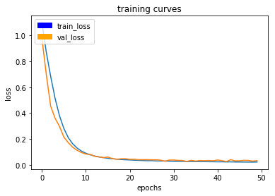
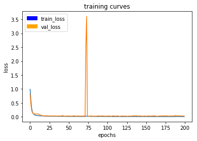
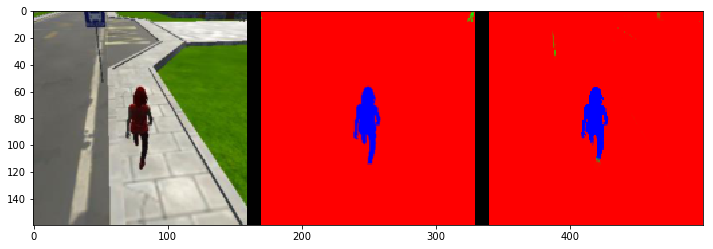
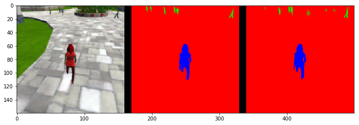
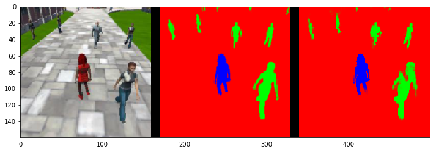
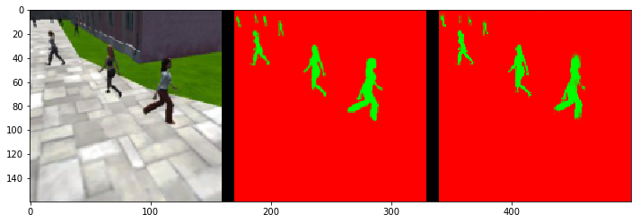
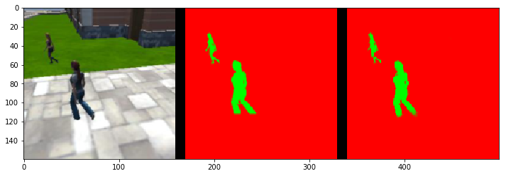
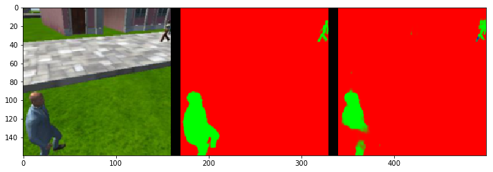
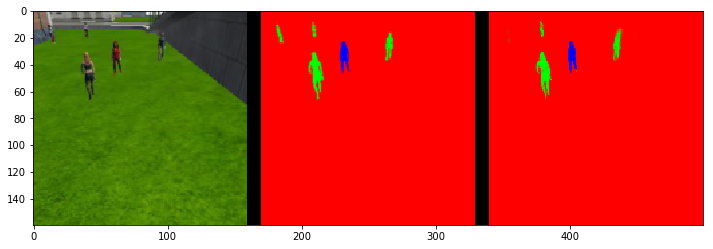

[](https://www.udacity.com/robotics)

# Project : Deep Learning Follow Me

## Writeup by Muthanna A. Attyah
## Mar 2018

In this project we will train a deep neural network to identify and track a target in simulation. So-called “follow me” applications like this are key to many fields of robotics and the very same techniques you apply here could be extended to scenarios like advanced cruise control in autonomous vehicles or human-robot collaboration in industry.

<p align="center">  </p>


## [Rubric](https://review.udacity.com/#!/rubrics/1155/view) Points

This means all network architecture should be explained The student clearly explains each layer of the network architecture and the role that it plays in the overall network. The student can demonstrate the benefits and/or drawbacks of different network architectures pertaining to this project and can justify the current network with factual data. Any choice of configurable parameters should also be explained in the network architecture.

The student demonstrates a clear understanding of 1 by 1 convolutions and where/when/how it should be used.
The student demonstrates a clear understanding of a fully connected layer and where/when/how it should be used.

The student is able to clearly articulate whether this model and data would work well for following another object (dog, cat, car, etc.) instead of a human and if not, what changes would be required.


# Software & Hardware used for training:

In order to get the best learning from the lab I have decided to use my own GPU enabled hardware to do the learning instead of using AWS Udacity ready made image.

I have used the following hardware:

* Lenovo Yoga 520 laptop (i7-8550U CPU @ 1.8GHz 16GB Memory)
* NVIDIA GEFORCE 940MX (2GB Memory 384 CUDA cores)

And the following OS/Drivers:

* Ubuntu 16.04 LTS
* NVIDIA Drivers 390.30
* NVIDIA CUDA 8.0
* NVIDIA cuDNN 5.1

And the following frameworks and packages:

* Python 3.x
* Tensorflow GPU 1.2.1
* NumPy 1.11
* SciPy 0.17.0
* eventlet 
* Flask
* h5py
* PIL
* python-socketio
* scikit-image
* transforms3d
* PyQt4/Pyqt5

It took me very long time to figure out the right version of CUDA/cuDNN that will match the selected version of TensorFlow-GPU then later I found this link which clearly states the required CUDA/cuDNN versions:

https://www.tensorflow.org/install/install_sources

# Data Recording

I did not record any data from simulator, I was able to do all required steps using the provided Training, Validation, and Sample Evaluation Data.

<table><tbody>
    <tr><th align="center" colspan="3"> Data Set 1</td></tr>
    <tr><th align="center">Folder</th><th align="center">Content</th></tr>
    <tr><td align="left">/data/train</td><td align="left">4,131 images + 4,131 masks</td></tr>
    <tr><td align="left">/data/validation</td><td align="left">1,184 images + 1,184 masks</td></tr>    
    <tr><td align="left">/data/sample_evalution_data/following_images</td>
       <td align="left">542 images + 542 masks</td></tr><tr>
    <td align="left">/data/sample_evalution_data/patrol_non_targ</td>
       <td align="left"> 270 images + 270 masks</td></tr><tr>
    <td align="left">/data/sample_evalution_data/patrol_with_targ</td>
       <td align="left"> 322 images + 322 masks</td></tr>
</tbody></table>


# Fully Convolutional Network (FCN) Layers

## Separable Convolutions Layer


```python
def separable_conv2d_batchnorm(input_layer, filters, strides=1):
    output_layer = SeparableConv2DKeras(filters=filters,kernel_size=3, strides=strides,
                             padding='same', activation='relu')(input_layer)
    
    output_layer = layers.BatchNormalization()(output_layer) 
    return output_layer
```

## Regular Convolution Layer

```python
def conv2d_batchnorm(input_layer, filters, kernel_size=3, strides=1):
    output_layer = layers.Conv2D(filters=filters, kernel_size=kernel_size, strides=strides, 
                      padding='same', activation='relu')(input_layer)
    
    output_layer = layers.BatchNormalization()(output_layer) 
    return output_layer
```

## Bilinear Upsampling Layer

```python
def bilinear_upsample(input_layer):
    output_layer = BilinearUpSampling2D((2,2))(input_layer)
    return output_layer
```
## Encoder Block

```python
def encoder_block(input_layer, filters, strides):
    
    # Create a separable convolution layer using the separable_conv2d_batchnorm() function.
    output_layer = separable_conv2d_batchnorm(input_layer, filters, strides)
    
    return output_layer
```

## Decoder Block

```python
def decoder_block(small_ip_layer, large_ip_layer, filters):
    
    # Upsample the small input layer using the bilinear_upsample() function.
    upsampled_small_ip_layer = bilinear_upsample(small_ip_layer)
    
    # Concatenate the upsampled and large input layers using layers.concatenate
    output_layer = layers.concatenate([upsampled_small_ip_layer, large_ip_layer])
    
    # Add some number of separable convolution layers
    output_layer = separable_conv2d_batchnorm( output_layer, filters, strides=1)
    output_layer = separable_conv2d_batchnorm( output_layer, filters, strides=1)
    
    return output_layer
```

## FCN Model

```python
def fcn_model(inputs, num_classes):
    
    # Add Encoder Blocks. 
    # Remember that with each encoder layer, the depth of your model (the number of filters) increases.
    layer01 = encoder_block(inputs , filters=32 , strides=2)
    layer02 = encoder_block(layer01, filters=64 , strides=2)
    layer03 = encoder_block(layer02, filters=128, strides=2)

    # Add 1x1 Convolution layer using conv2d_batchnorm().
    layer04 = conv2d_batchnorm(layer03, filters=256, kernel_size=1, strides=1)
    
    # Add the same number of Decoder Blocks as the number of Encoder Blocks
    layer05 = decoder_block(layer04, layer02, filters=128 )
    layer06 = decoder_block(layer05, layer01, filters=64  )
    x       = decoder_block(layer06, inputs , filters=32  )
    
    # The function returns the output layer of your model. "x" is the final layer obtained from the last decoder_block()
    return layers.Conv2D(num_classes, 1, activation='softmax', padding='same')(x)
```


# Neural Network Hyper Parameters

* **batch_size:** number of training samples/images that get propagated through the network in a single pass. When I used batch size of 64, 50, 40 and 32 I was getting "**ResourceExhaustedError : OOM when allocating tensor with shape..**" error. I was able to resolve it after reducing the batch size down to **20**. Below screen shot showing the utilization details of the GPU using this batch size:
<p align="center">  </p>

* **workers:** maximum number of processes to spin up. I used 8 workers to fully utilize the power of my Intel i7 processor cores. Below are the actual utilization graphs when no work is done and when training:

<p align="center">  </p>
<p align="center">  </p>

My plan to figureout the rest of parameters was mostly based on brute force; having my own GPU enabled tensorflow machine helped me alot in doing a good number of brute force runs as needed. Below are the captures of each attempt along with the related training curve:

* **learning_rate:** 

* **num_epochs:** number of times the entire training dataset gets propagated through the network.

* **steps_per_epoch:** number of batches of training images that go through the network in 1 epoch. One recommended value to try would be based on the total number of images in training dataset divided by the batch_size.

* **validation_steps:** number of batches of validation images that go through the network in 1 epoch. This is similar to steps_per_epoch, except validation_steps is for the validation dataset.


<table><tbody>
    <tr><th align="center" colspan="3">Parameters Set 1</td></tr>
    <tr><th align="center">Parameter</th><th align="center">Value</th><td align="center" rowspan="8">
    </td></tr>
    <tr><td align="left">learning_rate</td>   <td align="center">0.01</td></tr>
    <tr><td align="left">batch_size</td>      <td align="center">20</td></tr>
    <tr><td align="left">num_epochs</td>      <td align="center">40</td></tr>
    <tr><td align="left">steps_per_epoch</td> <td align="center">100</td></tr>
    <tr><td align="left">validation_steps</td><td align="center">50</td></tr>
    <tr><td align="left">workers</td>         <td align="center">8</td></tr>
    <tr><td align="left">final_score</td>     <td align="center">42%</td></tr>
</tbody></table>

<table><tbody>
    <tr><th align="center" colspan="3">Parameters Set 2</td></tr>
    <tr><th align="center">Parameter</th><th align="center">Value</th><td align="center" rowspan="8">
    </td></tr>
    <tr><td align="left">learning_rate</td>   <td align="center">0.001</td></tr>
    <tr><td align="left">batch_size</td>      <td align="center">20</td></tr>
    <tr><td align="left">num_epochs</td>      <td align="center">100</td></tr>
    <tr><td align="left">steps_per_epoch</td> <td align="center">200</td></tr>
    <tr><td align="left">validation_steps</td><td align="center">200</td></tr>
    <tr><td align="left">workers</td>         <td align="center">8</td></tr>
    <tr><td align="left">final_score</td>     <td align="center">40%</td></tr>
</tbody></table>

<table><tbody>
    <tr><th align="center" colspan="3">Parameters Set 3</td></tr>
    <tr><th align="center">Parameter</th><th align="center">Value</th><td align="center" rowspan="8">
    </td></tr>
    <tr><td align="left">learning_rate</td>   <td align="center">0.005</td></tr>
    <tr><td align="left">batch_size</td>      <td align="center">20</td></tr>
    <tr><td align="left">num_epochs</td>      <td align="center">100</td></tr>
    <tr><td align="left">steps_per_epoch</td> <td align="center">100</td></tr>
    <tr><td align="left">validation_steps</td><td align="center">100</td></tr>
    <tr><td align="left">workers</td>         <td align="center">8</td></tr>
    <tr><td align="left">final_score</td>     <td align="center">41%</td></tr>
</tbody></table>

<table><tbody>
    <tr><th align="center" colspan="3">Parameters Set 4</td></tr>
    <tr><th align="center">Parameter</th><th align="center">Value</th><td align="center" rowspan="8">
    </td></tr>
    <tr><td align="left">learning_rate</td>   <td align="center">0.003</td></tr>
    <tr><td align="left">batch_size</td>      <td align="center">20</td></tr>
    <tr><td align="left">num_epochs</td>      <td align="center">400</td></tr>
    <tr><td align="left">steps_per_epoch</td> <td align="center">50</td></tr>
    <tr><td align="left">validation_steps</td><td align="center">50</td></tr>
    <tr><td align="left">workers</td>         <td align="center">8</td></tr>
    <tr><td align="left">final_score</td>     <td align="center">39%</td></tr>
</tbody></table>

<table><tbody>
    <tr><th align="center" colspan="3">Parameters Set 5</td></tr>
    <tr><th align="center">Parameter</th><th align="center">Value</th><td align="center" rowspan="8">
    </td></tr>
    <tr><td align="left">learning_rate</td>   <td align="center">0.003</td></tr>
    <tr><td align="left">batch_size</td>      <td align="center">20</td></tr>
    <tr><td align="left">num_epochs</td>      <td align="center">250</td></tr>
    <tr><td align="left">steps_per_epoch</td> <td align="center">207</td></tr>
    <tr><td align="left">validation_steps</td><td align="center">60</td></tr>
    <tr><td align="left">workers</td>         <td align="center">8</td></tr>
    <tr><td align="left">final_score</td>     <td align="center">%</td></tr>
</tbody></table>

# Trained TensorFlow model

The files storing the final configuration of the model and the final weights are on the following links:

[Model Configuration](./data/weights/config_model_weights)

[Model Weights](./data/weights/model_weights)


# Prediction

To evaluate how well the FCN model is doing under different conditions. We will be using three different predictions available from the helper code provided and data provided (as mentioned above in data gathering section):

### following_images:
Test how well the network can identify the target while following them.

Images while following the target:

<p align="center">  </p>
<p align="center">  </p>
<p align="center">  </p>

### Scores for while the quad is following behind the target. 
```
number of validation samples intersection over the union evaulated on 542
average intersection over union for background is 0.9946233635164803
average intersection over union for other people is 0.35554427678476996
average intersection over union for the hero is 0.9043385744932508
number true positives: 539, number false positives: 0, number false negatives: 0
```

### patrol_non_targ:
Test how often the network makes a mistake and identifies the wrong person as the target.

Images while at patrol without target:

<p align="center">  </p>
<p align="center">  </p>
<p align="center">  </p>

### Scores for images while the quad is on patrol and the target is not visable
```
number of validation samples intersection over the union evaulated on 270
average intersection over union for background is 0.9852442884819069
average intersection over union for other people is 0.6481070478441583
average intersection over union for the hero is 0.0
number true positives: 0, number false positives: 145, number false negatives: 0
```

### patrol_with_targ: 
Test how well the network can detect the hero from a distance.

Images while at patrol with target:

<p align="center">  </p>
<p align="center">  </p>
<p align="center">  </p>

### This score measures how well the neural network can detect the target from far away
```
number of validation samples intersection over the union evaulated on 322
average intersection over union for background is 0.9960849086994017
average intersection over union for other people is 0.4355130043960404
average intersection over union for the hero is 0.25951798030115997
number true positives: 150, number false positives: 6, number false negatives: 151
```

# Evaluation

Sum all the true positives, etc from the three datasets to get a weight for the score: **0.6952573158425832**

The IoU for the dataset that never includes the hero is excluded from grading: **0.581928277397**

The Final Grade Score is the pixel wise:

```
average_IoU*(n_true_positive/(n_true_positive+n_false_positive+n_false_negative))
```

So the score is: **0.404589892156**

# Future Enhancements

* Recording a bigger dataset capturing more angles/distances of the target will help in further improving the network accuracy.

* Changing learning rate can also be helpful in reducing learning time.
